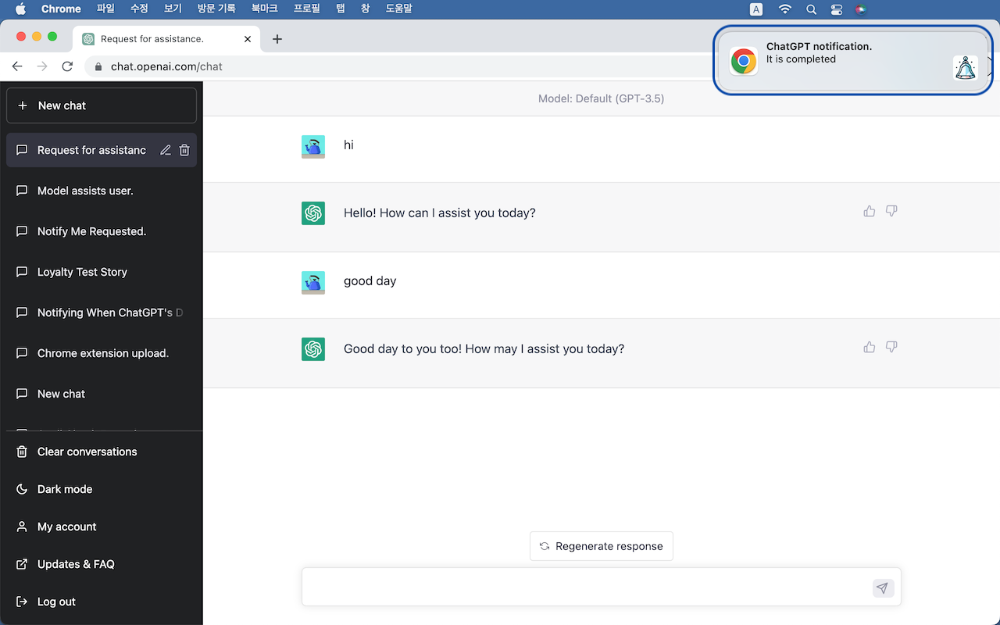

# ChatGPT notification

## English

A Chrome extension to show a notification when a chatgpt's response is completed.

monitors the ChatGPT user interface (UI) and sends a notification when a response is completed. This app ensures that users can multitask while waiting for ChatGPT's response without constantly checking the screen.

- this app does not collect any user data.
- very simple and safe app that does not need any network permission.

## getting started

- Click on "Code" in the top right corner of GitHub -> Download ZIP -> Extract the files
- Enter "chrome://extensions" in the Chrome address bar and navigate to the page -> Enable Developer Mode in - the top right corner -> Load unpacked extension from the extracted folder
- Go to the ChatGPT website and check if you receive any notifications (you might need to refresh the page)

## Chrome store

I am currently applying for Chrome Web Store. If it gets approved, I will leave the link.

## Korean

chatgpt의 응답이 완료되면 알림을 표시하는 Chrome 확장 프로그램입니다.

ChatGPT 사용자 인터페이스(UI)를 모니터링하고 응답이 완료되면 알림을 보냅니다. 이 앱은 사용자가 지속적으로 화면을 확인하지 않고 ChatGPT의 응답을 기다리는 동안 멀티태스킹을 할 수 있도록 합니다.

- 이 앱은 어떤 사용자 데이터도 수집하지 않습니다.
- 네트워크 권한이 필요 없는 매우 간단하고 안전한 앱입니다.

## 사용법

- github에서 우측 상단의 Code 클릭 -> Download ZIP -> 압축 풀기
- chrome://extensions 을 크롬 주소창에 입력하여 이동 -> 우측 상단의 개발자 모드 활성화 -> 압축 해제된 확장 프로그램을 로드합니다.
- chatgpt 사이트 이동 후 알림이 오는지 확인 (리로드 해야할 수 도 있음.)

## 크롬 스토어

지금 크롬 스토어 신청중입니다. 승인되면 링크 남기겠습니다.
